# Line Segmentation (Goal 2) — Unity Sentis Integration Guide:

End-to-end guide for exporting the Goal 2 `SpanUNet3D` line-segmentation model from PyTorch (Paperspace) and running it inside Unity via Unity Sentis. Mirrors the pole detector sidecar style (`PS_Unity_sidecar/`) but is a **single-stage** model: one ONNX + one sidecar JSON, no compute shader required.

Companion docs: [`README_Sparse3DUnet_semantic.md`](../README_Sparse3DUnet_semantic.md) (model + metrics), [`README_GOAL2.md`](../README_GOAL2.md) (training pipeline), [`PAPERSPACE_UPLOAD_AND_RUN.md`](../PAPERSPACE_UPLOAD_AND_RUN.md) (Paperspace upload/run).

---

## 1. Files in this folder 

| File | Role |
|------|------|
| `LineSegSentisInferenceManager.cs` | Unity MonoBehaviour: `Worker` on `BackendType.GPUCompute`, async readback, argmax → per-voxel class, optional dataset-style BMP gray bytes. |
| `LINE_SEG_UNITY_INTEGRATION.md` | This document. |

The Python export lives next to training: [`../line_seg/export_goal2_onnx.py`](../line_seg/export_goal2_onnx.py).

It produces, into your chosen output directory:

| File | Description |
|------|-------------|
| `line_seg_span_unet3d.onnx` | FP32 ONNX (opset 17 by default). |
| `line_seg_span_unet3d_fp16.onnx` | FP16 ONNX (only with `--fp16`). |
| `line_seg_sidecar.json` | Unity-side metadata (class names, I/O names, normalization, BMP mapping). |
| `export_log.txt` | Plain-text log: weights path, opset, sample shape, timings, verification result. |

---

## 2. Prerequisites

### Paperspace (export) 

```bash
pip install onnx onnxruntime onnxconverter-common
```

PyTorch is already needed for training; the export script imports `SpanUNet3D` from [`line_seg/model.py`](../line_seg/model.py) and reuses the checkpoint format produced by [`line_seg/train_goal2.py`](../line_seg/train_goal2.py) (`model_state`, `num_classes`, `base_channels`).

### Unity

- Unity 2023.2+ (or any version supporting Sentis 1.x).
- Sentis package: Window → Package Manager → + → Add package by name → `com.unity.sentis`.
- A GPU that supports compute shaders (Sentis uses `BackendType.GPUCompute`).

---

## 3. Run the export on Paperspace

From the `DUKE_FLORIDA_150` directory on your Paperspace instance:

```bash
cd /notebooks/DUKE_FLORIDA_150

# (One-time) install ONNX deps
pip install onnx onnxruntime onnxconverter-common

# FP32 only
python3 -m line_seg.export_goal2_onnx \
  --weights ./goal2_runs/exp_focal/best.pt \
  --out_dir ./onnx_export_goal2 \
  --opset 17

# FP32 + FP16 + parity check (recommended)
python3 -m line_seg.export_goal2_onnx \
  --weights ./goal2_runs/exp_focal/best.pt \
  --out_dir ./onnx_export_goal2 \
  --opset 17 \
  --fp16 \
  --verify
```

CLI flags ([`line_seg/export_goal2_onnx.py`](../line_seg/export_goal2_onnx.py)):

| Flag | Default | Description |
|------|---------|-------------|
| `--weights` | required | Path to `best.pt` / `last.pt` from training. |
| `--out_dir` | required | Output directory for ONNX + sidecar + log. |
| `--opset` | `17` | ONNX opset (matches the pole sidecar). |
| `--fp16` | off | Also write a converted FP16 ONNX. |
| `--verify` | off | Run an `onnxruntime` parity check on a synthetic span; record `max|Δ|`, `mean|Δ|`, `argmax_match` in the sidecar. |
| `--sample_T` | `64` | Dummy frame count used during export tracing (output is dynamic in `T`). |
| `--sample_H` | `224` | Dummy `H` (must be divisible by 4). |
| `--sample_W` | `128` | Dummy `W` (must be divisible by 4). |
| `--device` | `cpu` | Device used to trace (CPU is fine; export does not need a GPU). |

### Why `H, W` divisible by 4

The encoder pools twice with `MaxPool3d((1, 2, 2))`, so `H/4` and `W/4` must be integers. The export checks this before tracing; runtime input tensors must satisfy the same constraint.

### Output of a successful export

```
onnx_export_goal2/
├── line_seg_span_unet3d.onnx
├── line_seg_span_unet3d_fp16.onnx          (with --fp16)
├── line_seg_sidecar.json
└── export_log.txt
```

### Download the artifacts to your workstation

From your local machine (replace placeholders):

```bash
scp -r paperspace:/notebooks/DUKE_FLORIDA_150/onnx_export_goal2 ./
```

or download via the Paperspace UI.

---

## 4. ONNX I/O reference

| Direction | Name | Shape | Dtype | Notes |
|-----------|------|-------|-------|-------|
| Input | `volume` | `[1, 1, T, H, W]` | `float32` | NCDHW with `N=1`, `C=1`, `D=T` (frames). Pixel values in `[0, 1]` (raw uint8 / 255). |
| Output | `class_logits` | `[1, num_classes, T, H, W]` | `float32` | Raw logits — apply `argmax` along axis 1 to get a per-voxel class. |

Dynamic axes: `T`, `H`, `W` on both input and output. `H` and `W` must be divisible by 4.

---

## 5. Sidecar JSON reference

Generated by the export script:

| Key | Type | Description |
|-----|------|-------------|
| `format_version` | int | Sidecar schema version. |
| `model_arch` | string | `"SpanUNet3D"`. |
| `model_base` | int | UNet base channel width (e.g. 24). |
| `in_channels` | int | Always `1`. |
| `num_classes` | int | `7` for Goal 2. |
| `class_names` | list[string] | `["air", "solid", "comm", "primary", "neutral", "secondary", "transmission"]`. |
| `input_normalization` | string | Documents the divide-by-255 step. |
| `input_layout` | string | NCDHW (`N=C=1`, `D=T`). |
| `input_name` / `output_name` | string | Must match the C# manager constants. |
| `input_dynamic_axes` / `output_dynamic_axes` | object | Indexes of dynamic dims. |
| `sample_export_shape` | object | The dummy `T,H,W` used at export time (only for documentation). |
| `post_processing.argmax_dim` | int | `1` (class dim). |
| `post_processing.class_to_bmp_uint8` | object | Maps class index → dataset BMP gray. Air/solid are literal `255` / `0`; line classes are `pack_line_gray(0, type_code)`, i.e. `(0 << 3) \| type_code = type_code`. |
| `source_checkpoint` | string | Original `.pt` path (for traceability). |
| `fp32_onnx` / `fp16_onnx` | string | Filenames in the same folder. |
| `opset` / `precision` | int / string | ONNX opset and precision variants exported. |
| `verification` | object | When `--verify` is used: `max_abs_diff`, `mean_abs_diff`, `argmax_match` between PyTorch and onnxruntime. |
| `unity_runtime_notes` | object | Free-text reminders for Unity-side use. |

---

## 6. Unity project setup

### 6.1 Folder layout

```
Assets/
├── Models/LineSeg/
│   ├── line_seg_span_unet3d.onnx          (or _fp16 variant)
│   └── line_seg_sidecar.json
└── Scripts/LineSeg/
    └── LineSegSentisInferenceManager.cs
```

You can also place the ONNX and JSON under `Assets/StreamingAssets/LineSeg/` — but if you use the Inspector drag-and-drop pattern shown here, `Assets/Models/...` is simpler since Sentis auto-imports the ONNX as a `ModelAsset`.

### 6.2 Import

1. Drop the `.onnx` and `.json` files into `Assets/Models/LineSeg/`.
2. Drop `LineSegSentisInferenceManager.cs` into `Assets/Scripts/LineSeg/`.
3. Wait for Unity to compile and import.

### 6.3 Scene wiring

1. Create an empty GameObject named `LineSegInferencer`.
2. Add Component → `LineSegSentisInferenceManager`.
3. Inspector:

| Field | Assign |
|-------|--------|
| Model Asset | `line_seg_span_unet3d` (or `_fp16`) `.onnx` from `Assets/Models/LineSeg/`. |
| Sidecar Json | `line_seg_sidecar.json` (TextAsset). |
| Warmup On Start | `true` (runs a dummy forward in `Awake()`). |
| Log Diagnostics | `true` for per-frame timing logs. |
| Warmup T / H / W | `16 / 64 / 64` is fine; H and W must be divisible by 4. |

---

## 7. Calling inference from C#

```csharp
using UnityEngine;
using System.Threading.Tasks;

public class LineSegExample : MonoBehaviour
{
    [SerializeField] private LineSegSentisInferenceManager segmenter;

    public async Task RunAsync(byte[] uint8FramesTHW, int T, int H, int W)
    {
        // 1. Normalize bytes (0..255) -> floats (0..1) flattened over (T, H, W)
        float[] volume = LineSegSentisInferenceManager.NormalizeFrames(uint8FramesTHW);

        // 2. Inference
        var result = await segmenter.InferSpanVolumeAsync(volume, T, H, W, emitBmpGray: true);
        if (!result.success)
        {
            Debug.LogError($"LineSeg failed: {result.error}");
            return;
        }

        Debug.Log(
            $"Span done in {result.diagnostics.totalSeconds*1000:F1} ms; " +
            $"classes len={result.classes.Length}, num_classes={result.numClasses}");

        // 3. Optional: write predicted BMPs (one per frame) — same encoding as
        //    the Python infer_goal2.py predicted_bmp/ output.
        for (int t = 0; t < T; t++)
        {
            byte[] frame = new byte[H * W];
            System.Array.Copy(result.bmpGray, t * H * W, frame, 0, H * W);
            string outPath = System.IO.Path.Combine(
                Application.persistentDataPath, "lineseg", $"frame_{t:D4}.bmp");
            LineSegSentisInferenceManager.WriteBmpGrayFile(outPath, frame, H, W);
        }
    }
}
```

The `result.classes` byte array is the same as the Python `predicted_semantic_classes.npy`: row-major `(T, H, W)` with values `0..6`. `result.bmpGray` is what `tools/bmp_io.py::write_bmp_gray` would produce in `infer_goal2.py`.

---

## 8. Pipeline diagram

```mermaid
flowchart LR
    BMPs["Input BMPs / floats T,H,W"] --> Norm["Normalize / 255"]
    Norm --> Tensor["TensorFloat 1,1,T,H,W"]
    Tensor --> Worker["Sentis Worker GPUCompute"]
    Worker --> Logits["class_logits 1,7,T,H,W"]
    Logits --> Read["ReadbackAndCloneAsync"]
    Read --> Argmax["Argmax along class dim"]
    Argmax --> Classes["Per-voxel class 0..6"]
    Classes --> BmpMap["Class to BMP gray"]
    BmpMap --> Out["Predicted BMPs per frame"]
```



---

## 9. Troubleshooting

### Export

- `Checkpoint missing 'model_state'` — pass a `best.pt` or `last.pt` from `train_goal2.py`, not a raw `state_dict`.
- `H must be divisible by 4` (warmup or runtime) — pad or crop your span before passing it in.
- `FP16 conversion requires onnx and onnxconverter-common` — install both: `pip install onnx onnxconverter-common`.
- `Verification requires onnxruntime` — install: `pip install onnxruntime`.
- Trace works on CPU; do not need a GPU for export.

### Unity

- `Failed to parse line_seg_sidecar.json` — make sure it is assigned as a `TextAsset` in the Inspector.
- Model load errors — ensure `com.unity.sentis` is installed; right-click the ONNX → Reimport.
- FP16 NaNs — switch to the FP32 model. Some non-FP16-friendly GPUs cannot represent extreme logits.
- `Argument H must be divisible by 4` from the C# manager — same constraint as the encoder; pad your frames.
- Slow first call — warmup compiles GPU shaders; the second call is the steady-state latency. Keep `Warmup On Start = true`.
- High memory on large spans — the input is `1·1·T·H·W` floats and the output is `7·T·H·W` floats. Reduce `T` (e.g. tile the span) or downscale `H, W` if you exceed VRAM.

### Cross-validation against Python

For any span, the Unity output should byte-for-byte match `infer_goal2.py`'s `predicted_bmp/<frame>.bmp` and `predicted_semantic_classes.npy` (subject to FP precision differences if you use the FP16 ONNX). To compare:

1. Run `python3 -m line_seg.infer_goal2 --weights ... --input_dir ... --output_dir ...` on the same span.
2. Run the Unity manager on the same uint8 frames (divided by 255).
3. Compare the byte arrays / BMPs voxel-wise; you should see exact agreement on FP32 ONNX and `argmax_match >= 0.999` on FP16 ONNX.

---

## 10. Quick checklist

- [ ] `pip install onnx onnxruntime onnxconverter-common` on Paperspace.
- [ ] `python3 -m line_seg.export_goal2_onnx --weights ... --out_dir ./onnx_export_goal2 --fp16 --verify` ran successfully and printed `argmax_match ≥ 0.999`.
- [ ] `line_seg_span_unet3d.onnx`, `line_seg_span_unet3d_fp16.onnx`, `line_seg_sidecar.json` downloaded to `Assets/Models/LineSeg/`.
- [ ] `LineSegSentisInferenceManager.cs` is in `Assets/Scripts/LineSeg/`.
- [ ] GameObject `LineSegInferencer` has all Inspector fields assigned.
- [ ] `Warmup On Start` is enabled.
- [ ] First end-to-end inference logs `[LineSeg] T=... total=... ms` with no errors.
