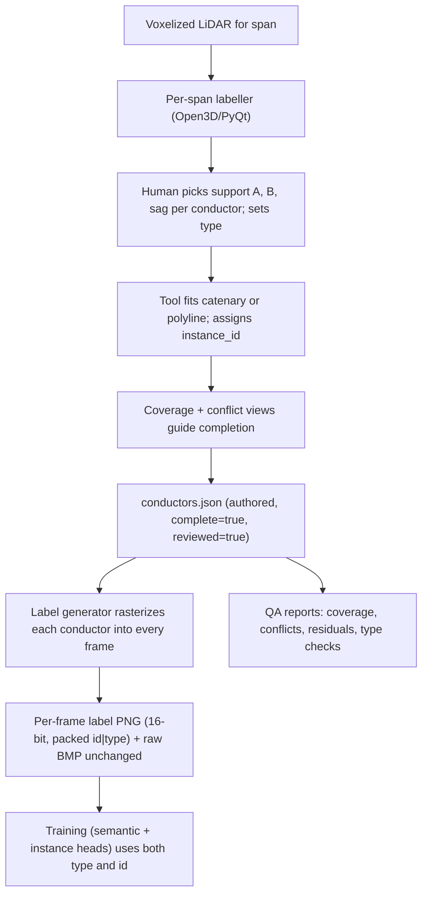

# Manual per-conductor line annotation at the LiDAR source

Companion guide to the Goal 2 line-segmentation work in this repo. The current dataset encodes line voxels in 8-bit BMPs with `(id_field << 3) | type_code`, capped at **32 instances per span** and offering **no structural guarantee that the same conductor keeps the same id across frames**. This document specifies a manual annotation procedure that fixes both: annotators label each conductor exactly once on the **3D voxelized LiDAR for the span**, and the per-frame BMP labels are then generated deterministically. Cross-frame identity becomes a property of the pipeline, not of annotator discipline.

Related reading: [`README_GOAL2.md`](README_GOAL2.md), [`README_Sparse3DUnet_semantic.md`](README_Sparse3DUnet_semantic.md), [`README_CATENARY_BASELINE.md`](README_CATENARY_BASELINE.md), [`tools/line_encoding.py`](tools/line_encoding.py), [`tools/catenary_ransac.py`](tools/catenary_ransac.py).

---

## 1. The paradigm shift

Current (per-frame source-of-truth):

```text
LiDAR voxel grid → for each frame: slice → BMP frame → human paints labels → saved BMP
                                                       (id is per-frame)
```

Proposed (per-span source-of-truth):

```text
LiDAR voxel grid for the whole span
        │
        ▼
Human annotator labels each conductor ONCE in 3D
        │   (assigns persistent instance_id, type, attributes)
        ▼
Per-span conductors.json  ←──  ground truth lives here
        │
        ▼
BMP / PNG generator (script):
   for each frame, rasterize every conductor's 3D curve
   into the frame's voxel slab → write per-voxel label byte/word
```

Because each conductor lives once in 3D, every frame the label generator visits inherits the **same** `instance_id` for the same conductor. No tracking, no auto-merge, no per-frame human bookkeeping.

---

## 2. What the annotator actually clicks (annotation primitives)

Conductors are thin, parametric, physically governed by gravity. The natural primitives are **catenaries** and **polylines** — not voxel painting.

### 2.1 Primary primitive: catenary per conductor

For each conductor visible in the span, the annotator picks **three** 3D points on the voxel grid:

- **Support A** — pole attachment on the near end of the span.
- **Support B** — pole attachment on the far end.
- **Sag point** — a mid-span point that visibly sits on the conductor.

The tool fits a catenary through these three points (the math in [`tools/catenary_ransac.py`](tools/catenary_ransac.py) already does this; here it is used to **fit** rather than search). Result: one parametric curve `c(s)` with parameters `(support_A, support_B, sag_a)` that fully defines the conductor.

The annotator immediately sees:

- A coloured curve rendered through the voxel cloud.
- A residual readout (RMSE of nearby conductor voxels to the curve) to confirm "this curve genuinely matches the LiDAR voxels".

If the conductor is not well-fit by a single catenary (kink, splice, transmission line with damper weights), it is annotated as a **polyline of catenaries** — e.g. two segments joined at a kink point.

### 2.2 Fallback / supplement: 3D polyline

For non-catenary cases (jumpers at poles, slack service drops) the annotator drops **N ≥ 2 anchor points** to define a piecewise-linear or spline curve. The schema treats catenary and polyline as two equivalent parameterisations of the same `Conductor` object.

### 2.3 Required and optional metadata per conductor

Tool-required (cannot be left blank):

- `id` — auto-assigned, unique within the span.
- `type_code` ∈ {comm, primary, neutral, secondary, transmission} — dropdown.
- `thickness_voxels` — 1, 2, or 3 (the rasterizer uses this).

Optional but useful:

- `phase` (A/B/C), `voltage_kV`, `owner`, `notes`, `confidence_flag`.

### 2.4 Negative / "checked, no conductor here" annotation

A full-confidence dataset must distinguish "we have not annotated yet" from "we have inspected and there is no further conductor". The schema therefore supports:

- A span-level `complete = true` flag, set only after a final review pass.
- An optional `noise_clusters` list naming voxel clusters that look like noise / vegetation / structures and should not be relabelled later.

Without these, the dataset cannot defend its own completeness.

---

## 3. Recommended tooling

You do not need to build a new annotator from scratch. The minimum viable stack is one general 3D viewer plus one small in-house plug-in or script.

### 3.1 Off-the-shelf options

| Tool | Strengths | Practical limits |
|------|-----------|------------------|
| **CloudCompare** | Free, mature point-cloud viewer, scriptable in Python. | UI is not conductor-aware; needs a custom scalar field. |
| **CVAT (≥ v2.x with 3D labels)** | Browser-based, polylines/cuboids, multi-user, role-based review. | Conductor-specific catenary fit must be added via plug-in. |
| **Supervisely (or Hasty.ai)** | 3D annotation, instance tracking, QA workflows. | Commercial; data leaves the building. |
| **Blender + small add-on** | Native NURBS / curve objects, custom properties, easy previews. | Heavy install; learning curve for non-Blender users. |
| **Open3D + PyQt** custom labeller | Exact UX, light to ship. | You maintain it. |

### 3.2 Recommended: a thin custom labeller

A **single-purpose conductor labeller** built on Open3D (or Three.js + Potree) takes a few days to write and pays back immediately. Minimum feature set:

- Load **one span voxel grid** at a time (the existing `T·H·W` array) and render it as a point cloud, colour-coded by intensity.
- Mouse picking that snaps to the nearest conductor-class voxel.
- Three-click catenary tool (support A, support B, sag) → instant fit + render coloured curve, residual readout.
- Polyline tool (multi-click) for non-catenary cases.
- Right-hand panel: list of annotated conductors with `id, type, residual, thickness, complete?` and a "show only this one" toggle.
- Hotkeys for type assignment (`1`=comm, `2`=primary, `3`=neutral, `4`=secondary, `5`=transmission).
- **Coverage view** — highlight any line-class voxels (`128..254` in the existing dataset) **not yet** within `thickness_voxels` of any annotated curve. Annotator finishes when this view is empty.
- **Conflict view** — voxels within thickness of **two** curves at once → flagged for review.
- Save to a per-span `conductors.json`.

This is far easier to maintain than grafting catenary semantics onto a generic tool, and the "coverage + conflict" pair is what gives the annotator confidence the span is complete.

---

## 4. Annotator workflow (per span)

A repeatable, full-confidence procedure:

1. **Load span** in the labeller. The tool shows the voxelized LiDAR as a 3D cloud, colour-coded by raw intensity.
2. **Overlay current line voxels** (the dataset's existing `128..254` mask) in a bright colour so the annotator can see exactly what must be assigned to a conductor.
3. **For each visible conductor**:
   1. Click support A → support B → sag point.
   2. Choose type from the dropdown (or hotkey).
   3. Tool fits the catenary, draws it, shows the residual.
   4. Adjust `thickness_voxels` if the line is thicker than 1 voxel.
   5. Use the polyline fallback only when catenary residual is unacceptable.
4. **Coverage check**: switch to the "unassigned voxels" view. Any remaining bright voxels → either annotate another conductor, or explicitly mark a cluster as `noise_cluster`.
5. **Conflict check**: switch to the "overlap" view. Resolve any voxels claimed by two curves (almost always means thickness too large; reduce thickness or split one curve into two).
6. **Type sanity**: the tool highlights conductors where the inferred type disagrees with the underlying voxel `type_code` (low 3 bits of the current label byte). Annotator corrects either the type or the underlying confusion.
7. **Mark complete**: set `complete = true` at the span level. Save.
8. **Independent review** (recommended): a second annotator opens the saved `conductors.json`, runs through the same coverage / conflict views, and signs off. The tool records `reviewed_by`.

Crucial properties of this workflow:

- **Identity is assigned at the moment of annotation** — not derived later.
- **No annotator ever touches a per-frame BMP**, so they cannot accidentally give the same conductor different ids in different frames.
- **Coverage and conflict views give an objective completion criterion**, not "I think we got them all".

---

## 5. Output: per-span `conductors.json`

The annotator's tool saves something like:

```json
{
  "schema_version": 1,
  "span_id": "206_213",
  "voxel_grid": { "T": 141, "H": 224, "W": 128, "voxel_size_m": 0.10 },
  "annotation": {
    "annotator": "alice",
    "reviewer":  "bob",
    "tool_version": "lineann-1.2.0",
    "completed_at": "2026-05-16T18:42:00Z",
    "complete": true,
    "confidence": "full"
  },
  "conductors": [
    {
      "id": 1,
      "type": "primary",
      "type_code": 1,
      "geometry": {
        "kind": "catenary",
        "support_A": [12.4,  3.1, 28.0],
        "support_B": [12.4, 51.6, 27.4],
        "sag_point": [12.4, 27.3, 25.9],
        "fitted_a": 14.7,
        "fit_rmse_voxels": 0.41
      },
      "thickness_voxels": 2,
      "metadata": { "phase": "A", "voltage_kV": 13.2 }
    },
    {
      "id": 2,
      "type": "transmission",
      "type_code": 4,
      "geometry": {
        "kind": "polyline",
        "anchors": [[1.0, 0.5, 30.1], [1.0, 24.0, 28.9], [1.0, 50.0, 29.5]],
        "spline": "linear"
      },
      "thickness_voxels": 3,
      "metadata": {}
    }
  ],
  "noise_clusters": [
    { "centroid": [80, 5, 12], "voxel_count": 38, "reason": "vegetation echo" }
  ]
}
```

This file is the **single source of truth** for the span. The BMP / PNG frames become a derived product.

---

## 6. The label generator (deterministic, from `conductors.json`)

A small script `tools/gen_labels_from_conductors.py` does the rasterization. Pseudocode:

```text
for each frame f in span:
    label_volume_slice = zeros(H, W, dtype=uint16)
    air_mask          = (raw_voxel_slice == empty)
    solid_mask        = (raw_voxel_slice == solid)

    label_volume_slice[air_mask]   = SENTINEL_AIR     # 0xFFFF
    label_volume_slice[solid_mask] = SENTINEL_SOLID   # 0x0000

    for conductor in conductors.json:
        curve  = build_curve(conductor.geometry)              # catenary or polyline
        voxels = rasterize_curve_into_frame(curve, frame_index,
                                            thickness=conductor.thickness_voxels)
        for (y, x) in voxels:
            if label_volume_slice[y, x] in (SENTINEL_AIR, SENTINEL_SOLID, 0):
                label_volume_slice[y, x] = pack(conductor.id, conductor.type_code)
            else:
                # conflict — already claimed by another conductor.
                # record (frame, y, x, id_a, id_b) for the QA report; do not overwrite.
                conflicts.append(...)

    write_label_image(frame_path, label_volume_slice)
```

Key properties:

- **One pass per span**, fully deterministic. Re-running on the same `conductors.json` produces byte-identical labels.
- **Conflicts are logged**, not silently masked, so the human can see when two conductors fight for the same voxel.
- **Thickness is a property of the conductor**, not the rasterizer — so you can re-render at higher resolution later without re-annotating.
- The rasterizer is the same on **every** frame, which is what guarantees cross-frame identity.

---

## 7. Updated label encoding (16-bit PNG)

Switch the label image from 8-bit BMP to **16-bit grayscale PNG** (or keep BMP with one extra channel). Suggested encoding:

```text
16-bit label value = (instance_id << 5) | type_code
  bits  0..4 : type_code        (5 bits, 5 used)
  bits  5..15 : instance_id     (11 bits → 2048 ids per span)

reserved sentinels:
  0xFFFF = air
  0x0000 = solid
```

PNG is lossless, well supported in Python (`Pillow.Image.open(..).convert("I;16")`), and a one-line change in `tools/bmp_io.py`.

This bumps the budget from 32 conductors / span → 2048 conductors / span and gives the label generator room to write conductor identity faithfully.

Optional: also write a **plain semantic BMP** (current 8-bit, type only) next to each label PNG for backward compatibility with the existing trainer until it is switched over.

---

## 8. How cross-frame identity is now structurally guaranteed

Because every frame is rendered from the **same `conductors.json`** using the **same id per conductor**:

- `instance_id == 7` in frame 12 and `instance_id == 7` in frame 38 are, by construction, the same physical conductor.
- A renaming of conductor ids is impossible mid-span (the loop iterates one JSON; ids are immutable).
- If a conductor is added, removed, or split during a future re-annotation, you just re-run the label generator — the dataset stays internally consistent.
- 3D connected-component tracking is no longer needed for identity (it remains useful only as a QA tool: "did the renderer place voxel groups that are 3D-connected? if not, the catenary thickness might be too thin").

---

## 9. Annotator-facing QA aids that keep confidence at 100%

To make "full confidence" enforceable rather than aspirational, the labelling tool should provide these views and gates:

1. **Coverage report** per span — percentage of pre-existing line voxels (`128..254` in raw data) within `thickness_voxels` of at least one annotated curve. Must be **100%** before sign-off; remaining voxels must be tagged as `noise_cluster`.
2. **Per-conductor residual** — RMSE of nearby line voxels to the fitted curve, in voxel units. Anything above a threshold (e.g. 0.75 voxel) flags the catenary as a likely mis-fit, suggesting a polyline.
3. **Conflict log** — list of `(frame, y, x)` where the rasterizer found ≥ 2 curves competing. Must be empty before sign-off.
4. **Type-vs-voxel cross-check** — for each conductor, the histogram of underlying voxel `type_code` values should be dominated by the assigned type. A mismatch (e.g. annotator picked `primary` but most voxels say `transmission`) flags it for review.
5. **Cross-frame visualization** — render a strip of all `T` frames overlaid with the curve of one selected conductor so temporal coherence can be inspected at a glance.
6. **Sign-off gate** — `annotator` **and** `reviewer` fields must both be filled; tool refuses to mark `complete = true` otherwise.

These six gates turn "full confidence" from a promise into something the tool enforces.

---

## 10. End-to-end pipeline summary



The recipe:

1. Pick (or build) a tool that lets a human label conductors as **3D curves on the voxelized LiDAR for the whole span**.
2. Save the human's work as **`conductors.json`** — one authoritative file per span, with stable `instance_id` and `type_code` for every conductor.
3. Replace the current per-frame label authoring with a deterministic **`gen_labels_from_conductors.py`** that rasterizes the JSON into every frame.
4. Upgrade the on-disk label container to **16-bit PNG** (11-bit id + 5-bit type) so 2048 conductors fit, and keep the raw frame BMPs untouched.
5. Enforce **coverage + conflict + dual-review** gates in the tool so "full confidence" is verified, not assumed.

This gives a single human pass per span, full-confidence per-conductor labels, and cross-frame identity by construction — without any post-hoc tracking scripts.
