# `SpanUNet3D` — lightweight 3D UNet for span semantic segmentation

This document explains the **semantic segmentation model** used for Goal 2: a compact 3D UNet that takes a full span volume and predicts a per-voxel class. It covers the architecture in [`line_seg/model.py`](line_seg/model.py), how [`line_seg/train_goal2.py`](line_seg/train_goal2.py) uses it to produce Precision / Recall / IoU via [`line_seg/eval_metrics.py`](line_seg/eval_metrics.py), and how to interpret IoU on this dataset.

Related reading: [`README_GOAL2.md`](README_GOAL2.md) (end-to-end Goal 2 pipeline), [`README_CATENARY_BASELINE.md`](README_CATENARY_BASELINE.md) (object-level RANSAC baseline), [`POWER_LINE_DETECTION_PLAN.md`](POWER_LINE_DETECTION_PLAN.md) (overall phases), [`PAPERSPACE_UPLOAD_AND_RUN.md`](PAPERSPACE_UPLOAD_AND_RUN.md) (training / inference on Paperspace).

---

## 1. Architecture

A span is a `T × H × W` volume of 8-bit BMP frames (`frame_*.bmp`). The model operates on the whole span at once.

- **Input** tensor shape: `[B, C, T, H, W]` with `C = 1` (raw pixel / 255).
- **Output** tensor shape: `[B, num_classes, T, H, W]` per-voxel logits; `num_classes = 7`.
- Classes: `0=air(255)`, `1=solid(0)`, `2=comm`, `3=primary`, `4=neutral`, `5=secondary`, `6=transmission` (see the class table in [`README_GOAL2.md`](README_GOAL2.md)).

### 1.1 Building block: `ConvBlock3D`

```21:37:DUKE_FLORIDA_150/line_seg/model.py
class ConvBlock3D(nn.Module):
    """Conv–Norm–ReLU ×2. Uses GroupNorm so batch_size=1 does not destabilize training like BatchNorm."""

    def __init__(self, c_in: int, c_out: int):
        super().__init__()
        g = _group_norm_groups(c_out)
        self.net = nn.Sequential(
            nn.Conv3d(c_in, c_out, kernel_size=3, padding=1, bias=False),
            nn.GroupNorm(g, c_out),
            nn.ReLU(inplace=True),
            nn.Conv3d(c_out, c_out, kernel_size=3, padding=1, bias=False),
            nn.GroupNorm(g, c_out),
            nn.ReLU(inplace=True),
        )
```

Design choices:

- **`3×3×3` convolutions on all three axes `(T, H, W)`** so the receptive field covers adjacent **frames** as well as spatial neighbors. This turns a pixel on a thin conductor into a continuous 3D tube in the model's view.
- **Two convs per block** grow the receptive field before each down/up-sample.
- **`bias=False`** because the affine parameters live in `GroupNorm`.
- **`GroupNorm`** with groups picked by `_group_norm_groups` (prefer 8, fall back to 4/2/1 to ensure `num_channels % g == 0`). Required because training uses **`batch_size=1`** — `BatchNorm` would collapse on a single-volume batch, and span `T` varies.

### 1.2 Encoder, bottleneck, decoder

```40:69:DUKE_FLORIDA_150/line_seg/model.py
class SpanUNet3D(nn.Module):
    def __init__(self, num_classes: int = 7, in_channels: int = 1, base: int = 24):
        super().__init__()
        b = base
        self.enc1 = ConvBlock3D(in_channels, b)
        self.pool1 = nn.MaxPool3d((1, 2, 2))
        self.enc2 = ConvBlock3D(b, b * 2)
        self.pool2 = nn.MaxPool3d((1, 2, 2))
        self.mid  = ConvBlock3D(b * 2, b * 4)
        self.dec2 = ConvBlock3D(b * 2 + b * 4, b * 2)
        self.dec1 = ConvBlock3D(b + b * 2, b)
        self.out_conv = nn.Conv3d(b, num_classes, kernel_size=1)
```

With the training default `base=24`, the channel widths are:

| Stage | Channels |
|-------|----------|
| `enc1` | 24 |
| `enc2` | 48 |
| `mid` (bottleneck) | 96 |
| `dec2` (after concat `48 + 96`) | 48 |
| `dec1` (after concat `24 + 48`) | 24 |
| `out_conv` (`1×1×1`) | `num_classes = 7` |

Two architectural points worth flagging:

- **Spatial-only pooling (`MaxPool3d((1, 2, 2))`)** — the `T` axis is **never down-sampled**. This keeps per-frame resolution even on short spans (e.g. `T=9`) and lets the network emit one class map per original frame without temporal resampling.
- **Decoder upsamples with `F.interpolate(..., mode="trilinear")`** then applies a `ConvBlock3D` (no `ConvTranspose3d`). As the module docstring notes:

```1:5:DUKE_FLORIDA_150/line_seg/model.py
"""
Lightweight 3D UNet for T×H×W span volumes.

Decoder uses trilinear upsampling + conv to avoid off-by-one issues with odd H,W.
"""
```

Transposed convolutions with odd `H` or `W` (common here) can produce shapes off by one from the encoder skip; interpolating to `encoder_feature.shape[2:]` enforces exact alignment before `torch.cat([u2, e2], dim=1)`.

### 1.3 Data flow

```mermaid
flowchart LR
    In["x [1,1,T,H,W]"] --> enc1["enc1: Conv3D block -> 24 ch"]
    enc1 -->|"skip"| cat1
    enc1 --> pool1["MaxPool3D (1,2,2)"]
    pool1 --> enc2["enc2: Conv3D block -> 48 ch"]
    enc2 -->|"skip"| cat2
    enc2 --> pool2["MaxPool3D (1,2,2)"]
    pool2 --> mid["mid: Conv3D block -> 96 ch"]
    mid --> up2["trilinear upsample to enc2 size"]
    up2 --> cat2["concat: 48+96"]
    cat2 --> dec2["dec2: Conv3D block -> 48 ch"]
    dec2 --> up1["trilinear upsample to enc1 size"]
    up1 --> cat1["concat: 24+48"]
    cat1 --> dec1["dec1: Conv3D block -> 24 ch"]
    dec1 --> out["1x1x1 Conv3D -> num_classes=7"]
    out --> Out["logits [1,7,T,H,W]"]
```



### 1.4 Why this helps identify conductor lines

- **Conductor voxels are rare and thin** (≈1 % of voxels, 1–3 px wide). A 3×3×3 kernel with two spatial pool stages yields a receptive field of several dozen pixels along `H,W` and multiple frames along `T` — matching the physical object: a **1D curve in 3D** that is coherent across adjacent frames.
- **Skip connections** preserve fine `H,W` detail so the decoder can keep a line one voxel wide after fusing coarse semantic features with high-resolution ones.
- **7-way softmax** produces the dataset encoding directly; `CLASS_NAMES` is defined at the top of [`line_seg/train_goal2.py`](line_seg/train_goal2.py) and reused by inference / evaluation.
- **Temporal convs without temporal pooling** give a stable per-frame output and implicitly encourage **temporal continuity** of a conductor across frames — the core cue that separates a real line from a stray labeled voxel.

### 1.5 Known limitations

- Only **2 pooling stages**; effective receptive field is limited, so very long-range sag / catenary continuity is not captured. The RANSAC + catenary baseline in [`tools/`](tools/) (see [`README_CATENARY_BASELINE.md`](README_CATENARY_BASELINE.md)) is the complementary object-level method.
- The head is **semantic only** — it does not assign a stable conductor **id** across frames. Instance identity is reconstructed downstream by 3D connected components on merged line classes (see §3.2).

---

## 2. How `train_goal2.py` uses the model

### 2.1 Loss (what is minimized)

Training uses `SegmentationLoss` from [`line_seg/losses.py`](line_seg/losses.py): **weighted cross-entropy** (optionally focal) plus **optional multiclass Dice**.

```72:105:DUKE_FLORIDA_150/line_seg/losses.py
class SegmentationLoss(nn.Module):
    """Cross-entropy (optionally focal) + optional multiclass Dice."""

    def __init__(
        self,
        num_classes: int,
        dice_weight: float = 0.5,
        class_weights: torch.Tensor | None = None,
        *,
        line_class_ce_boost: float = 1.0,
        line_class_min: int = 2,
        focal_gamma: float = 0.0,
    ):
        ...

    def forward(self, logits: torch.Tensor, target: torch.Tensor) -> torch.Tensor:
        w = self.class_weights.to(logits.device, dtype=logits.dtype)
        if self.focal_gamma > 0.0:
            ce = _weighted_focal_nll(logits, target, w, self.focal_gamma)
        else:
            ce = F.cross_entropy(logits, target.long(), weight=w)
        if self.dice_weight <= 0:
            return ce
        d = dice_loss_multiclass(logits, target.long(), num_classes=self.num_classes)
        return ce + self.dice_weight * d
```

- **Class imbalance** is handled by `--ce_class_weights` (explicit per-class weights) or `--line_class_ce_boost` (multiplies the weight of line classes `>= 2`), and by Dice, which is scale-invariant (Dice is 0 if a class is missed entirely, regardless of its pixel area).
- **Hard-voxel focus**: when `--focal_gamma > 0`, CE is replaced by a focal-style loss `(1 - p_t)^gamma * -log p_t`.

### 2.2 Per-epoch validation — producing the pixel metrics

After each epoch (and once more at the end with `best.pt`), `evaluate_loader` runs the full validation loader, accumulates a confusion matrix on the GPU, and streams labels to CPU for the sklearn classification report.

```163:203:DUKE_FLORIDA_150/line_seg/train_goal2.py
def evaluate_loader(...):
    ...
    cm_t = torch.zeros((num_classes, num_classes), dtype=torch.int64, device=device)
    ...
    for x, y, _name in loader:
        ...
        logits = m(x)
        ...
        pred = logits.argmax(dim=1)[0].long()
        yt = y[0].long()
        confusion_matrix_accumulate_torch(pred, yt, num_classes, cm_t)
        ...
        object_per_span.append(line_object_detection_scores(p_cpu, y_cpu))
        ...
    cm = cm_t.cpu().numpy()
    scores = scores_from_confusion(cm)
    obj_micro = aggregate_object_metrics(object_per_span)
```

The confusion matrix is the single source of truth for pixel-level Precision / Recall / IoU. Per-span object metrics are computed alongside it.

**Checkpointing**: by default `best.pt` is selected on **`val_mean_iou`**, not loss (see `--checkpoint_metric` in `train_goal2.py`). Pixel accuracy is near 1 on this dataset (§4), so loss and accuracy are noisy proxies; mIoU is the primary signal.

### 2.3 Artifacts written

Under `goal2_runs/<experiment>/`:

- `best.pt` / `last.pt` — model checkpoints (`model_state`, `num_classes`, `base_channels`).
- `train_log.jsonl` / `metrics_history.json` — per-epoch losses, `val_mean_iou`, macro P/R/F1, per-class IoU, line-object micro P/R/F1, seconds.
- `history_loss.png`, `history_scores.png` — training curves.
- `confusion_matrix.npy` / `confusion_matrix.png` — full-val pixel confusion matrix with `best.pt`.
- `validation_report.txt` — ASCII confusion matrix + sklearn classification report + JSON scalar summary + training-log diagnosis.
- `run_meta.json` — train / val split and loss hyperparameters for reproducibility.

See [`README_GOAL2.md`](README_GOAL2.md) for the full output table.

---

## 3. How Precision, Recall, and IoU are computed

### 3.1 Pixel-level (per class, from the confusion matrix)

Rows of the confusion matrix `cm` are **true** labels, columns are **predicted** labels.

```165:193:DUKE_FLORIDA_150/line_seg/eval_metrics.py
def scores_from_confusion(cm, eps=1e-9):
    num_classes = cm.shape[0]
    tp = np.diag(cm).astype(np.float64)
    pred_sum = cm.sum(axis=0).astype(np.float64)  # sum over true -> per pred col
    true_sum = cm.sum(axis=1).astype(np.float64)  # per true row

    precision = tp / (pred_sum + eps)
    recall    = tp / (true_sum + eps)
    union     = true_sum + pred_sum - tp
    iou       = tp / (union + eps)

    macro_p = float(np.nanmean(precision))
    macro_r = float(np.nanmean(recall))
    macro_f1 = float(2 * macro_p * macro_r / (macro_p + macro_r + eps)) if (macro_p + macro_r) > 0 else 0.0
    mean_iou = float(np.nanmean(iou))
    total = cm.sum()
    acc = float(tp.sum() / (total + eps))
    ...
```

For each class `c` over all validation voxels:

- `TP_c` = `cm[c, c]` (diagonal)
- `FP_c` = `sum(cm[:, c]) - TP_c` (predicted `c` but truly something else)
- `FN_c` = `sum(cm[c, :]) - TP_c` (truly `c` but predicted otherwise)

Then:

- **Precision_c** = `TP_c / (TP_c + FP_c)`
- **Recall_c** = `TP_c / (TP_c + FN_c)`
- **IoU_c** = `TP_c / (TP_c + FP_c + FN_c)` = `|pred_c ∩ gt_c| / |pred_c ∪ gt_c|`

Aggregates:

- **`mean_iou` (mIoU)** — unweighted mean over the 7 per-class IoUs.
- **`macro_precision` / `macro_recall`** — unweighted mean over classes.
- **`macro_f1`** — harmonic mean of `macro_p`, `macro_r`.
- **`pixel_accuracy`** — `sum(TP) / total`. Dominated by air/solid on this dataset (§4).

A parallel sklearn `classification_report` is generated over concatenated flat `(y, p)` arrays for per-class Precision / Recall / F1 with pixel-count support.

### 3.2 Object-level (per conductor instance)

To answer "did we find each conductor, not just the right voxels?", all 5 line classes are merged into one binary mask and treated as 3D objects:

```209:284:DUKE_FLORIDA_150/line_seg/eval_metrics.py
def line_object_detection_scores(
    pred: np.ndarray,
    target: np.ndarray,
    *,
    line_class_min: int = 2,
    line_class_max: int = 6,
    iou_match_thresh: float = 0.5,
) -> dict[str, float]:
    """
    3D connected components on merged line masks; greedy IoU matching.
    ...
    """
    pred = np.asarray(pred)
    target = np.asarray(target)
    pb, tb = binary_line_masks(pred, target, line_class_min=line_class_min, line_class_max=line_class_max)

    inter = np.logical_and(pb, tb).sum()
    union = np.logical_or(pb, tb).sum()
    line_pixel_iou = float(inter / (union + 1e-9))

    struct = ndimage.generate_binary_structure(3, 1)
    lp, np_ = ndimage.label(pb, structure=struct)
    lg, ng  = ndimage.label(tb, structure=struct)
```

- Merge classes `2..6` into a binary "any conductor" mask.
- `scipy.ndimage.label` with 3D 6-connectivity labels **each conductor as one 3D object** across frames.
- **Greedy match**: for every predicted component, match to the unmatched GT component with the highest IoU; a match counts as **TP** when IoU ≥ **0.5**.
- Unmatched predicted components → **FP**; unmatched GT → **FN**.
- `aggregate_object_metrics` sums TP / FP / FN across all validation spans and returns **micro** precision / recall / F1 plus `line_pixel_iou_mean_span`.

This gives an **instance-style** signal even though the network is purely semantic.

---

## 4. Interpreting IoU for this dataset

The formula `IoU_c = |pred_c ∩ gt_c| / |pred_c ∪ gt_c|` is fixed; what matters is how it behaves on spans of thin conductors.

### 4.1 Extreme class imbalance

Most voxels in a span are `air (255)` or `solid (0)`; line classes are ≈ 1 % of voxels. Consequences:

- `IoU(air)` and `IoU(solid)` are naturally very high (often `> 0.98`).
- `IoU` of each line class is much lower, because a **single-voxel shift** on a 1-voxel-wide conductor removes almost all of both the intersection and a large fraction of the union.
- **`mean_iou` is an unweighted mean**, so the rare line classes pull it down sharply. A report showing `mIoU = 0.45` with `IoU(air) = 0.99`, `IoU(solid) = 0.97`, and `IoU(conductor) = 0.10–0.40` is typical.
- **Pixel accuracy is near 1** even for a weak detector — which is why training tracks `val_mean_iou`, not accuracy.

### 4.2 Thin-structure sensitivity

Conductors are 1–3 voxels wide. IoU uses voxel-strict intersection, so **boundary accuracy dominates**. A model that paints a conductor **2 voxels thick when the GT is 1** roughly halves its IoU even though it looks right. Rule-of-thumb bands for line-class IoU on this dataset:

| IoU range | Interpretation |
|-----------|----------------|
| `< 0.20` | Detector is localizing roughly but shape/thickness is off (or confusing line types). |
| `0.20 – 0.50` | Meaningful detector; pair with `line_obj_f1_micro` to see whether individual conductors are found. |
| `0.50 – 0.70` | Strong pixel agreement; conductors are usually the right thickness and position. |
| `> 0.70` | Very strong — close to human-labeled voxel positions. |

### 4.3 Per-class vs merged binary line IoU

Per-class IoU **also penalizes type confusion**: a `primary` conductor predicted as `neutral` adds to FP/FN of both classes and contributes 0 to intersection of either. The merged binary mask IoU exposed as `line_pixel_iou` answers the simpler question "is this voxel a conductor at all":

- If **merged `line_pixel_iou` is much higher than the mean per-class line IoU**, errors are mostly **type confusion**, not localization.
- If both are low together, the model is missing conductors or drawing them in the wrong place.

### 4.4 Per-span vs global

`scores_from_confusion` runs on the **global** confusion matrix (one big sum over all val voxels), which is equivalent to a **support-weighted** IoU. A few large spans can dominate. `line_pixel_iou_mean_span` (average of per-span pixel IoU, see `aggregate_object_metrics`) exposes variability across spans — compare the two to see whether results hinge on one span.

### 4.5 IoU ↔ F1 relationship

For any single class, `IoU = TP / (TP + FP + FN)` and `F1 = 2·TP / (2·TP + FP + FN)`, so

\[
F_1 = \frac{2 \cdot \text{IoU}}{1 + \text{IoU}}
\]

Rankings are identical. Macro F1 reported by `scores_from_confusion` is computed from macro Precision / Recall rather than averaging per-class F1, so it can differ slightly from `2·mIoU / (1 + mIoU)`.

### 4.6 How to read a validation report

1. Ignore pixel accuracy (it is ~99 % for almost anything on this dataset).
2. Look at **`mean_iou`** and the **per-class IoU for classes 2–6** (line types). Low values here are the real failure mode.
3. Compare **merged `line_pixel_iou`** to the mean of per-class line IoUs. A big gap means errors are **type confusion**, not **localization**.
4. Check **`line_obj_f1_micro`** and `line_obj_tp / fp / fn` to see whether individual conductors are being recovered at IoU ≥ 0.5.
5. Cross-reference with `history_scores.png` and the training-log diagnosis in `validation_report.txt` for stability across epochs.

---

## 5. Related documents

- [`README_GOAL2.md`](README_GOAL2.md) — Goal 2 pipeline, inference, full file layout.
- [`README_CATENARY_BASELINE.md`](README_CATENARY_BASELINE.md) — RANSAC + catenary object-level baseline for comparison.
- [`POWER_LINE_DETECTION_PLAN.md`](POWER_LINE_DETECTION_PLAN.md) — overall phases (semantic → instance → 3D reconstruction).
- [`PAPERSPACE_UPLOAD_AND_RUN.md`](PAPERSPACE_UPLOAD_AND_RUN.md) — running training and inference on Paperspace.
