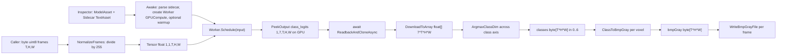

# `LineSegSentisInferenceManager.cs` — step-by-step working

Companion document to [`unity_export/LineSegSentisInferenceManager.cs`](unity_export/LineSegSentisInferenceManager.cs). This file walks through the manager's runtime behavior, the input it expects, how the output is produced on the GPU, and how each voxel is labelled. The manager targets **Unity Sentis 2.6.1** and consumes the ONNX produced by [`line_seg/export_goal2_onnx.py`](line_seg/export_goal2_onnx.py).

Related reading: [`README_Sparse3DUnet_semantic.md`](README_Sparse3DUnet_semantic.md) (model + metrics), [`README_GOAL2.md`](README_GOAL2.md) (training pipeline), [`unity_export/LINE_SEG_UNITY_INTEGRATION.md`](unity_export/LINE_SEG_UNITY_INTEGRATION.md) (Unity project setup), [`PAPERSPACE_UPLOAD_AND_RUN.md`](PAPERSPACE_UPLOAD_AND_RUN.md) (Paperspace upload + run).

The flow has four phases: **setup**, **input preparation**, **inference + readback**, **post-processing & labelling**.

---

## 1. Inputs

### 1.1 What you assign in the Inspector

```48:61:DUKE_FLORIDA_150/unity_export/LineSegSentisInferenceManager.cs
    [Header("Sentis Model Asset (drag .onnx file here)")]
    [SerializeField] private ModelAsset modelAsset;

    [Header("Sidecar Config (drag .json TextAsset here)")]
    [SerializeField] private TextAsset sidecarJson;

    [Header("Runtime Options")]
    [SerializeField] private bool warmupOnStart = true;
    [SerializeField] private bool logDiagnostics = true;

    [Header("Warmup span dims (must be divisible by 4 in H, W)")]
    [SerializeField] private int warmupT = 16;
    [SerializeField] private int warmupH = 64;
    [SerializeField] private int warmupW = 64;
```

- **`modelAsset`** — the ONNX produced on Paperspace by `line_seg/export_goal2_onnx.py` (e.g. `line_seg_span_unet3d.onnx` or its `_fp16` variant). It declares one input `volume` of shape `[1, 1, T, H, W]` (`float32`) and one output `class_logits` of shape `[1, num_classes, T, H, W]`.
- **`sidecarJson`** — the matching `line_seg_sidecar.json` TextAsset. Only a small subset is parsed (`SidecarConfig` class, line 74); it supplies `num_classes` plus the I/O names and is the single source of truth shared between Paperspace export and Unity.
- **Runtime toggles** — warmup-on-start and verbose timing logs.
- **Warmup dims** — a tiny synthetic span used in `Awake()` to compile GPU shaders once.

### 1.2 What you pass at runtime (the actual data input)

```183:192:DUKE_FLORIDA_150/unity_export/LineSegSentisInferenceManager.cs
    /// <summary>
    /// Run inference on a single span volume.
    /// </summary>
    /// <param name="volume">Flat T*H*W array of float in [0,1] (raw uint8 / 255).</param>
    /// <param name="T">Number of frames.</param>
    /// <param name="H">Frame height.</param>
    /// <param name="W">Frame width.</param>
    /// <param name="emitBmpGray">Also fill classes-to-BMP gray bytes (air=255, solid=0, line=pack).</param>
    public async Task<LineInferenceResult> InferSpanVolumeAsync(
        float[] volume, int T, int H, int W, bool emitBmpGray = true)
```

The single runtime input is the **span volume** in the same shape Python training expects:

- **One flat `float[]` of length `T·H·W`**, row-major over `(T, H, W)`.
- **Values in `[0, 1]`** — i.e. raw 8-bit BMP pixel divided by 255. A helper for this exists: `NormalizeFrames(byte[])` (lines 326–333). This is the exact equivalent of `vol.astype(np.float32) / 255.0` in `line_seg/infer_goal2.py::_forward_span`.
- **`H` and `W` must be divisible by 4** because the encoder pools spatially twice with `MaxPool3d((1, 2, 2))`. The manager validates this on line 203.

---

## 2. Setup (one-time, in `Awake`)

```129:143:DUKE_FLORIDA_150/unity_export/LineSegSentisInferenceManager.cs
    private void Awake()
    {
        if (modelAsset == null)
            throw new InvalidOperationException("Assign modelAsset in Inspector.");
        if (sidecarJson == null)
            throw new InvalidOperationException("Assign sidecarJson in Inspector.");

        _cfg = JsonUtility.FromJson<SidecarConfig>(sidecarJson.text);
        if (_cfg == null)
            throw new InvalidOperationException("Failed to parse line_seg_sidecar.json.");

        _worker = new Worker(ModelLoader.Load(modelAsset), BackendType.GPUCompute);

        if (warmupOnStart) _ = WarmupAsync();
    }
```

What happens, in order:

1. **Validation** — the Inspector slots must be filled.
2. **Sidecar parse** — `JsonUtility.FromJson<SidecarConfig>` gives `_cfg.num_classes` (used by the argmax loop) and the I/O names. The class names themselves stay in the JSON for documentation; the manager only stores the **integer count**.
3. **Sentis worker creation** — `ModelLoader.Load(modelAsset)` turns the imported `ModelAsset` into a Sentis `Model`; `new Worker(model, BackendType.GPUCompute)` allocates a compute-backed worker. The worker holds the GPU graph for the lifetime of the GameObject.
4. **Warmup** (optional, `WarmupAsync`, lines 150–177) — feeds a zero tensor of the configured warmup shape so Sentis compiles all kernels once. Without this, the **first** real inference also pays the kernel-compile cost.
5. **Cleanup** — `OnDestroy` disposes the worker.

---

## 3. Inference (per call to `InferSpanVolumeAsync`)

`InferSpanVolumeAsync` is fully `async`/awaitable so GPU work does not stall the Unity main thread. The five sub-steps below all live inside the `try` block of lines 197–266.

### 3.1 Validate dimensions

```199:205:DUKE_FLORIDA_150/unity_export/LineSegSentisInferenceManager.cs
            int expected = T * H * W;
            if (volume == null || volume.Length != expected)
                throw new ArgumentException(
                    $"volume length {volume?.Length ?? 0} != T*H*W = {expected}");
            if (H % 4 != 0 || W % 4 != 0)
                throw new ArgumentException(
                    $"H and W must be divisible by 4 (encoder pools (1,2,2) twice); got H={H}, W={W}");
```

Catches the two most common errors before any GPU work happens.

### 3.2 Wrap the float buffer in a 5D Sentis tensor

```207:210:DUKE_FLORIDA_150/unity_export/LineSegSentisInferenceManager.cs
            // 1. Prepare input tensor (NCDHW with N=C=1, D=T)
            double p0 = Time.realtimeSinceStartupAsDouble;
            using var input = new Tensor<float>(new TensorShape(1, 1, T, H, W), volume);
            double p1 = Time.realtimeSinceStartupAsDouble;
```

- The PyTorch network requires **NCDHW** layout: `(N=1, C=1, D=T, H, W)`. We construct exactly that.
- `using var` ensures the tensor is disposed at the end of the method (after the await), which releases its CPU/GPU storage.

### 3.3 Schedule the model on the GPU

```212:222:DUKE_FLORIDA_150/unity_export/LineSegSentisInferenceManager.cs
            // 2. Schedule on GPU. The single-input overload is the Sentis 2.6 idiom
            //    (Worker.Schedule(Tensor input)); it binds positionally to the first
            //    model input, which for this graph is `volume`.
            _worker.Schedule(input);

            var logits = _worker.PeekOutput(ClassLogitsOutputName) as Tensor<float>;
            if (logits == null)
                throw new InvalidOperationException(
                    $"PeekOutput returned no Tensor<float> for '{ClassLogitsOutputName}'. " +
                    "Verify the ONNX output name matches the sidecar / exporter.");
            double s1 = Time.realtimeSinceStartupAsDouble;
```

- **`_worker.Schedule(input)`** — the Sentis 2.6 single-input overload. It enqueues the entire UNet (`enc1 → pool → enc2 → pool → mid → trilinear upsample → dec2 → trilinear upsample → dec1 → 1×1×1 classifier`) on the compute backend.
- **`PeekOutput("class_logits")`** returns a **backend-resident** `Tensor<float>` of shape `[1, num_classes, T, H, W]` (`num_classes = 7`). At this point the data still lives on the GPU.

### 3.4 Async read-back to CPU

```224:230:DUKE_FLORIDA_150/unity_export/LineSegSentisInferenceManager.cs
            // 3. Async readback (avoid stalling main thread).
            //    Sentis 2.6: ReadbackAndCloneAsync() returns Awaitable<Tensor<float>>.
            //    Awaiting it gives a CPU-resident Tensor<float>; DownloadToArray() copies
            //    its data into a managed float[] (ToReadOnlyArray was removed in 2.x).
            using var logitsCpu = await logits.ReadbackAndCloneAsync();
            float[] logitsArr = logitsCpu.DownloadToArray();
            double r1 = Time.realtimeSinceStartupAsDouble;
```

- `await logits.ReadbackAndCloneAsync()` waits for the GPU to finish, then copies the logits into a CPU-resident clone (`Tensor<float>`).
- `DownloadToArray()` returns the flat `float[]` of length `1·7·T·H·W = 7·T·H·W` in **C-order**, i.e. **`(class, T, H, W)`** with class as the slowest-varying axis. This layout matters in step 3.5.

### 3.5 Argmax → byte class map (and optionally BMP gray)

```232:237:DUKE_FLORIDA_150/unity_export/LineSegSentisInferenceManager.cs
            // 4. Argmax over class dim → byte class map; optional BMP gray
            int classes = _cfg.num_classes;
            byte[] classMap = new byte[expected];
            byte[] bmpGray = emitBmpGray ? new byte[expected] : null;
            ArgmaxClassDim(logitsArr, classes, T, H, W, classMap, bmpGray);
            double q1 = Time.realtimeSinceStartupAsDouble;
```

`ArgmaxClassDim` (lines 283–307) is the core post-processor:

```283:307:DUKE_FLORIDA_150/unity_export/LineSegSentisInferenceManager.cs
    private static void ArgmaxClassDim(
        float[] logits, int classes, int T, int H, int W,
        byte[] classOut, byte[] bmpOut)
    {
        int planeSize = T * H * W;
        for (int v = 0; v < planeSize; v++)
        {
            float best = logits[v];
            int bestC = 0;
            for (int c = 1; c < classes; c++)
            {
                float val = logits[c * planeSize + v];
                if (val > best)
                {
                    best = val;
                    bestC = c;
                }
            }
            classOut[v] = (byte)bestC;
            if (bmpOut != null)
            {
                bmpOut[v] = ClassToBmpGray((byte)bestC);
            }
        }
    }
```

- `planeSize = T·H·W` is the stride between consecutive class slices in the flat array.
- For each voxel `v`, the inner loop walks across the **class dimension** (`logits[c·planeSize + v]` for `c = 0..6`) and picks the class with the largest logit. This is exactly `logits.argmax(dim=1)[0]` from `infer_goal2.py::_forward_span`.
- The chosen class index is stored as one byte in `classMap[v]`. The full array `classMap` is the per-voxel semantic prediction in row-major `(T, H, W)` order — the C# counterpart of the Python `predicted_semantic_classes.npy`.
- If `emitBmpGray = true`, the same voxel is converted to a dataset-style gray byte via `ClassToBmpGray` (§4.2).

This step is intentionally a straightforward CPU loop because the output is tiny compared to the model itself and Sentis is already the critical-path GPU work.

### 3.6 Package the result and diagnostics

```239:260:DUKE_FLORIDA_150/unity_export/LineSegSentisInferenceManager.cs
            result.success = true;
            result.classes = classMap;
            result.bmpGray = bmpGray;
            result.diagnostics = new InferenceDiagnostics
            {
                prepareSeconds = p1 - p0,
                scheduleSeconds = s1 - p1,
                readbackSeconds = r1 - s1,
                postprocessSeconds = q1 - r1,
                totalSeconds = q1 - t0,
            };

            if (logDiagnostics)
            {
                Debug.Log(
                    $"[LineSeg] T={T} H={H} W={W}  " +
                    $"prepare={result.diagnostics.prepareSeconds*1000:F1}ms  " +
                    $"sched={result.diagnostics.scheduleSeconds*1000:F1}ms  " +
                    $"readback={result.diagnostics.readbackSeconds*1000:F1}ms  " +
                    $"post={result.diagnostics.postprocessSeconds*1000:F1}ms  " +
                    $"total={result.diagnostics.totalSeconds*1000:F1}ms");
            }
```

The caller gets back a `LineInferenceResult` containing:

- `success` / `error` — `success = false` and `error = e.ToString()` if anything in the `try` threw.
- `T, H, W, numClasses` — the dimensions echoed back so the caller does not have to track them.
- `classes` — `byte[T·H·W]` of class indices `0..6`.
- `bmpGray` — `byte[T·H·W]` of dataset BMP gray bytes, or `null` if `emitBmpGray = false`.
- `diagnostics` — per-phase timings (also printed if `logDiagnostics` is on).

---

## 4. How the output is labelled

The labelling is the same encoding used everywhere else in this repo (training, `infer_goal2.py`, `tools/line_encoding.py`). Two steps.

### 4.1 From logits to class index (per voxel)

The 7-way semantic head produces one logit per class per voxel. The argmax in `ArgmaxClassDim` picks the highest-scoring class. The class index meaning (defined in `train_goal2.py::CLASS_NAMES` and the sidecar):

| `bestC` | Meaning |
|---------|---------|
| 0 | `air` |
| 1 | `solid` / non-line |
| 2 | `comm` (line type 0) |
| 3 | `primary` (line type 1) |
| 4 | `neutral` (line type 2) |
| 5 | `secondary` (line type 3) |
| 6 | `transmission` (line type 4) |

So **`result.classes[v]`** is the human-readable label for voxel `v` via that table.

### 4.2 From class index back to dataset BMP gray (`ClassToBmpGray`)

```309:319:DUKE_FLORIDA_150/unity_export/LineSegSentisInferenceManager.cs
    /// <summary>
    /// Map class index 0..6 to dataset BMP gray (matches infer_goal2.py /
    /// tools/line_encoding.py::pack_line_gray with id_field = 0).
    /// </summary>
    public static byte ClassToBmpGray(byte cls)
    {
        if (cls == 0) return 255;     // air
        if (cls == 1) return 0;       // solid
        int typeCode = cls - 2;       // 0..4
        return (byte)((0 << 3) | (typeCode & 0x07));
    }
```

The dataset stores labelled voxels in BMPs with one of three kinds of gray values:

- **`255`** — air pixel.
- **`0`** — solid (non-line) pixel.
- **`128 ≤ gray < 255`** — line pixel, where the byte is packed as `(id_field << 3) | type_code` (see `tools/line_encoding.py::pack_line_gray`). The low 3 bits identify the line type (0=comm, 1=primary, 2=neutral, 3=secondary, 4=transmission); the high 5 bits are an instance id.

The semantic head does **not** predict an instance id (Goal 2 is semantic-only), so the manager packs lines with `id_field = 0`:

| `cls` | Output byte |
|-------|-------------|
| 0 (air) | `255` |
| 1 (solid) | `0` |
| 2 (`comm`, type 0) | `(0<<3) \| 0 = 0` |
| 3 (`primary`, type 1) | `(0<<3) \| 1 = 1` |
| 4 (`neutral`, type 2) | `(0<<3) \| 2 = 2` |
| 5 (`secondary`, type 3) | `(0<<3) \| 3 = 3` |
| 6 (`transmission`, type 4) | `(0<<3) \| 4 = 4` |

With `id_field = 0` the line bytes are small numbers, not in the `128..254` range. That matches `infer_goal2.py::semantic_classes_to_label_uint8`, which packs the same way; the `128..254` range only appears when an instance id ≥ 16 is present in the dataset.

### 4.3 Writing the BMPs

Finally, `WriteBmpGrayFile` (lines 336–377) writes any of the per-frame `H·W` slices of `result.bmpGray` to disk as an 8-bit grayscale BMP (256-entry palette, top-down DIB, row stride padded to 4). The format is **byte-for-byte compatible with `tools/bmp_io.py::read_bmp_gray`**, so:

```csharp
for (int t = 0; t < result.T; t++)
{
    byte[] frame = new byte[result.H * result.W];
    System.Array.Copy(result.bmpGray, t * result.H * result.W, frame, 0, frame.Length);
    LineSegSentisInferenceManager.WriteBmpGrayFile(
        Path.Combine(Application.persistentDataPath, "lineseg", $"frame_{t:D4}.bmp"),
        frame, result.H, result.W);
}
```

reproduces, on Unity, the `predicted_bmp/frame_*.bmp` output that the Python `infer_goal2.py` writes — same encoding, Python-readable files.

---

## 5. End-to-end summary diagram



So in one sentence: the manager **wraps a normalized span as a 5D Sentis tensor, runs `SpanUNet3D` on the GPU, reads the `[1, 7, T, H, W]` logits back, argmax-labels each voxel as one of 7 semantic classes, and (optionally) emits Python-compatible labelled BMPs.**
